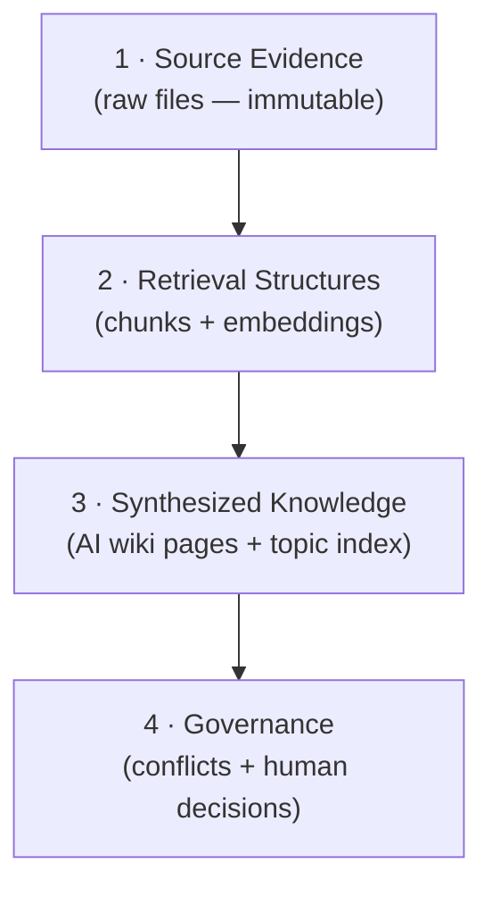
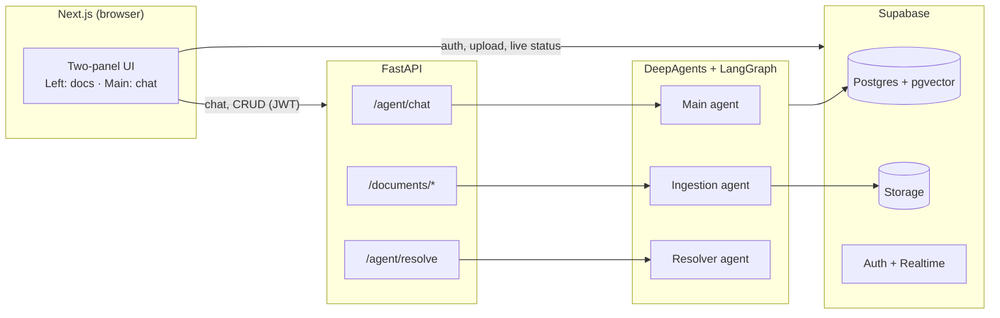
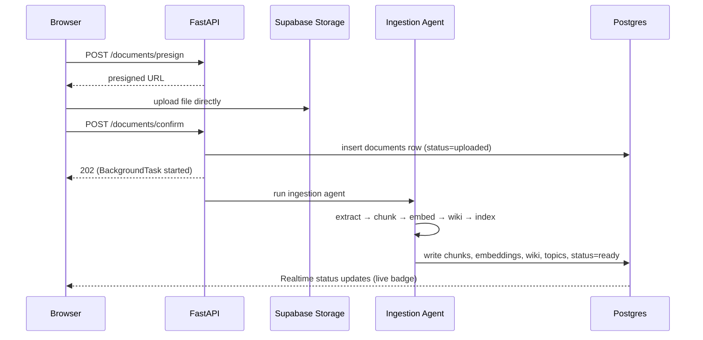
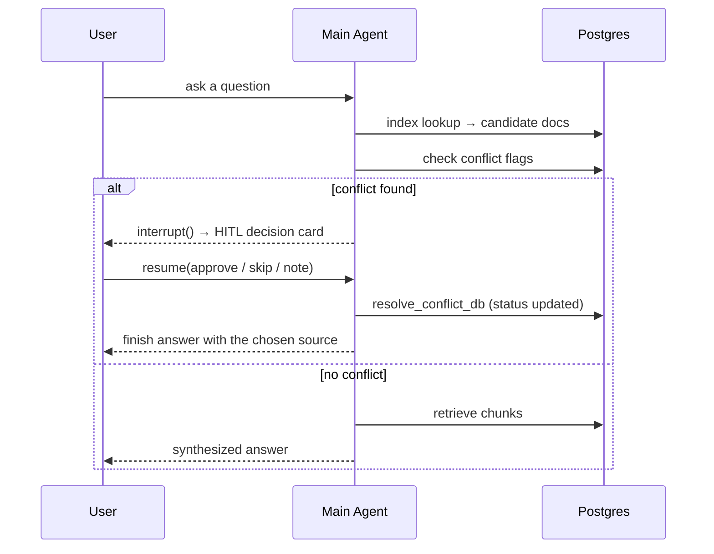

# Architecture

A concise tour of how chat-wiki is built, the decisions behind it, and the two flows that matter most: **ingestion** and **conflict-aware retrieval**.

---

## The core idea

Everything hangs off a four-level **knowledge hierarchy**, ordered by how much we trust it:

The rule that falls out of this: **lower levels are never derived from higher ones.** Embeddings come from raw text, not from AI summaries. The assistant can synthesize and govern, but it can't rewrite your files. This is what makes answers auditable back to real evidence.

---

## System shape

**Data-access boundary** is deliberate: the browser talks to Supabase *directly* only for auth, file upload, and Realtime status. Every database write goes through FastAPI with the service role. The client never holds privileged DB access.

### Why these tools
- **DeepAgents + LangGraph** — we need tool-using agents *and* the ability to pause mid-run for human input. LangGraph's `interrupt()` gives us HITL for free; DeepAgents gives us a clean tool/sub-agent harness.
- **AG-UI over SSE** — one streaming protocol carries tokens, tool-call progress, and interrupt payloads to the browser, so the chat UI reacts to everything the agent does in real time.
- **Supabase** — Postgres, vector search (pgvector), file storage, auth, and Realtime in one service kept the moving parts down under a short timeline.
- **A switchable model provider** — LLM, embeddings, and checkpointer all sit behind one module, so swapping OpenAI ↔ Gemini or dev ↔ prod persistence is a one-line change.

---

## Flow 1 — Ingestion

Upload is direct-to-storage (presigned URL) so large files never round-trip through the API. Registration then kicks off a background agent pipeline; the UI follows progress over Supabase Realtime.

A document is **queryable only when `status == ready`.** Embeddings are written from raw chunks alone — the wiki page is generated for humans, not for retrieval.

---

## Flow 2 — Conflict-aware retrieval (HITL)

This is the heart of the product. A separate **resolver agent** scans documents and records conflicts in the DB — it *only flags*, never deletes or overwrites. Later, when the **main agent** retrieves evidence to answer a question and hits a flagged conflict, it interrupts and hands the decision to the user.

Key properties:
- **One conflict per interrupt** — the user faces a single, unambiguous choice.
- **Resume is a LangGraph command**, carried back over the same `/agent/chat` SSE channel.
- On resolve, the conflict's status changes in the DB and the left-panel flag clears without a manual refresh.

---

## Data model

Four tables carry the system:

| Table | Holds |
|---|---|
| `documents` | one row per file: `status`, `summary`, `topics[]` (the index), `wiki_page` |
| `chunks` | raw text chunks + pgvector `embedding` for similarity search |
| `conflicts` | a detected conflict: type, status, optional preferred document |
| `conflict_documents` | join — which documents belong to a conflict |

`documents.status` is the gatekeeper: retrieval always checks it before touching a document.

---

## Future improvements
- **Citation deep-links** from an answer back to the exact source chunk.
